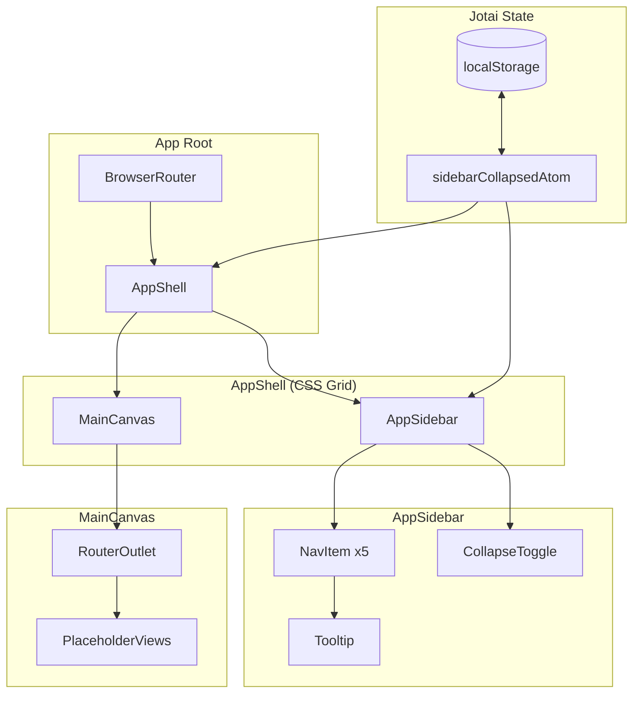

# High Level Design: Core Layout Shell & Sidebar

## 1. Executive Summary

This epic establishes the foundational layout infrastructure for the Ripples application, implementing a desktop layout shell with a persistent left sidebar for main navigation. The sidebar provides spatial consistency and serves as the navigation anchor for users working with the time-based canvas.

**Key Objectives:**
- Create a stable structural frame that all other UI components will live inside
- Implement sidebar with collapse/expand functionality and state persistence
- Establish main canvas container with independent scrolling behavior
- Enable navigation between 5 primary application sections

**High-Level Approach:**
Adopt shadcn/ui with Base UI backend for accessible, well-tested components with modern primitives. Use Jotai atoms with localStorage persistence for sidebar state. Implement CSS Grid for the shell layout structure with React Router for client-side navigation.

---

## 2. Complexity Assessment

**Rating: M (Medium)**

| Factor | Assessment | Notes |
|--------|------------|-------|
| Scope | Medium | 4-6 new components, 5 user stories |
| Technical Risk | Medium | New dependencies (shadcn/ui + Base UI, React Router, Jotai) |
| Integration Complexity | Medium | Routing integration, component library setup |
| Data Migration | Low | No data migration, localStorage only |

**Key Complexity Drivers:**
1. Introducing shadcn/ui infrastructure with Base UI primitives - requires initial setup in Nx monorepo
2. Smooth CSS transitions requiring animation choreography between collapse/expand states
3. Independent scroll containers for sidebar vs canvas requiring proper overflow handling

---

## 3. System Context

### Current System State

The Ripples web application has a minimal entry point at `apps/web/src/app/app.tsx` with no established layout infrastructure. This epic creates the foundational UI structure.

### External Dependencies

| Dependency | Status | Action Required |
|------------|--------|-----------------|
| shadcn/ui (Base UI backend) | NOT INSTALLED | Run `npx shadcn create` and select Base UI |
| React Router DOM | NOT INSTALLED | Install `react-router-dom@^7` |
| Jotai | NOT INSTALLED | Install `jotai` for atomic state management |
| Tailwind CSS | INSTALLED | Configure for shadcn/ui animations |
| lucide-react | NOT INSTALLED | Install for iconography |

### Technology Stack Summary

- **Frontend:** React 19, Vite 7, Tailwind CSS 3.4
- **Component Library:** shadcn/ui with Base UI backend
- **Primitives:** @base-ui/react (single unified package)
- **Routing:** React Router v7 (to be installed)
- **State:** Jotai with localStorage persistence
- **Testing:** Vitest 4 (unit), Playwright 1.36 (E2E)

### Required Packages

```bash
# Single Base UI package (vs multiple @radix-ui/* packages)
@base-ui/react

# State management
jotai

# shadcn/ui utilities
class-variance-authority
clsx
tailwind-merge
tailwindcss-animate
lucide-react
```

### Backwards Compatibility

N/A - This is new foundational infrastructure with no existing layout to maintain compatibility with.

---

## 4. Requirements Analysis

### Functional Requirements

| ID | Requirement | Source |
|----|-------------|--------|
| FR-1 | Persistent sidebar visible on desktop (≥1024px) | Story 1 |
| FR-2 | Sidebar displays 5 navigation items with icons | Story 1 |
| FR-3 | Current section visually highlighted in sidebar | Story 1 |
| FR-4 | Sidebar collapse/expand to icon-only mode | Story 2 |
| FR-5 | Tooltips on hover in collapsed mode | Story 2 |
| FR-6 | Sidebar state persists across navigation | Story 3 |
| FR-7 | Sidebar state persists across page refresh | Story 3 |
| FR-8 | Click navigation items to route to sections | Story 4 |
| FR-9 | Main canvas fills remaining horizontal space | Story 5 |
| FR-10 | Canvas scrolls independently (sidebar fixed) | Story 5 |

### Non-Functional Requirements

| ID | Requirement | Target |
|----|-------------|--------|
| NFR-1 | Collapse/expand animation duration | 150-200ms |
| NFR-2 | No layout shift on state transitions | Zero CLS |
| NFR-3 | No FOUC on initial render | Immediate state hydration |
| NFR-4 | Smooth transition performance | <16ms frame time |

### Technical Constraints

- Desktop breakpoint: 1024px minimum width
- localStorage must be available for state persistence
- Client-side routing (SPA architecture)

### Design Specifications

| Specification | Value |
|---------------|-------|
| Sidebar expanded width | 240px |
| Sidebar collapsed width | 56px |
| Default route | `/stream` (Daily Stream) |
| Toggle button position | Bottom of sidebar |

### Out of Scope

- Mobile sidebar behavior (Epic 03)
- Top utility bar (Epic 02)
- Right contextual pane (Epic 02)
- Command palette / search (Epic 04)
- Actual view content for navigation destinations
- Keyboard shortcuts for sidebar toggle

---

## 5. Architecture Overview

### System Architecture Diagram



### Frontend Layer

- **AppShell:** Root layout container using CSS Grid with two columns (sidebar + canvas)
- **AppSidebar:** shadcn/ui Sidebar component (Base UI backend) with NavigationMenu integration
- **MainCanvas:** Scrollable content container with React Router Outlet
- **Jotai Atoms:** Atomic state management for sidebar collapse state with localStorage sync

### Data Layer

- **localStorage:** Persists sidebar collapse preference with key `ripples:sidebar:collapsed`
- **Jotai Atom:** Provides reactive sidebar state to component tree

### Integration Points

- React Router for navigation between sections
- shadcn/ui component primitives (powered by Base UI) for accessible UI
- Tailwind CSS for styling with CSS custom properties for sidebar dimensions
- Jotai for lightweight atomic state management

---

## 6. Data Model Strategy

### Entities

#### SidebarState (Jotai Atom)

```typescript
import { atomWithStorage } from "jotai/utils";

// Persisted atom with localStorage sync
export const sidebarCollapsedAtom = atomWithStorage(
    "ripples:sidebar:collapsed",
    false
);
```

**Storage:** localStorage with key `ripples:sidebar:collapsed`
**Format:** JSON stringified boolean (`true` | `false`)

#### NavRoute

```typescript
interface NavRoute {
    path: string;
    label: string;
    icon: ComponentType;
}
```

### Route Configuration

```typescript
const routes: NavRoute[] = [
    { path: "/stream", label: "Daily Stream", icon: Activity },
    { path: "/patterns", label: "Patterns", icon: LineChart },
    { path: "/work-items", label: "Work Items", icon: ListTodo },
    { path: "/teams", label: "Teams/Spaces", icon: Users },
    { path: "/settings", label: "Settings", icon: Settings },
];
```

### Indexing & Migration

N/A - No database entities. localStorage is key-value only.

---

## 7. API Design Strategy

**N/A for this epic**

This is a purely client-side UI implementation with no backend API requirements. All state is managed in the browser via localStorage.

---

## 8. Frontend Architecture

### Component Structure

```
apps/web/src/
├── app/
│   ├── layout/
│   │   ├── AppShell.tsx           # Main shell with Grid layout
│   │   ├── AppShell.spec.tsx
│   │   ├── MainCanvas.tsx         # Scrollable content container
│   │   └── MainCanvas.spec.tsx
│   ├── sidebar/
│   │   ├── AppSidebar.tsx         # Sidebar using shadcn/ui
│   │   ├── AppSidebar.spec.tsx
│   │   ├── NavItem.tsx            # Individual nav item
│   │   └── NavItem.spec.tsx
│   └── routes/
│       ├── routes.config.ts       # Route definitions
│       └── PlaceholderView.tsx    # Generic placeholder
├── components/
│   └── ui/                        # shadcn/ui components (Base UI backend)
│       ├── sidebar.tsx
│       ├── navigation-menu.tsx
│       ├── tooltip.tsx
│       └── button.tsx
└── state/
    └── sidebar.ts                 # Jotai atoms for sidebar state
```

### State Management Approach

**Jotai with localStorage Persistence**

```typescript
// state/sidebar.ts
import { atom } from "jotai";
import { atomWithStorage } from "jotai/utils";

// Persisted collapsed state
export const sidebarCollapsedAtom = atomWithStorage(
    "ripples:sidebar:collapsed",
    false
);

// Derived toggle action
export const toggleSidebarAtom = atom(
    null,
    (get, set) => {
        set(sidebarCollapsedAtom, !get(sidebarCollapsedAtom));
    }
);
```

**Usage in Components**

```typescript
// AppSidebar.tsx
import { useAtom, useSetAtom } from "jotai";
import { sidebarCollapsedAtom, toggleSidebarAtom } from "@/state/sidebar";

export function AppSidebar() {
    const [collapsed] = useAtom(sidebarCollapsedAtom);
    const toggle = useSetAtom(toggleSidebarAtom);

    return (
        <Sidebar data-collapsed={collapsed}>
            {/* ... */}
            <button onClick={toggle}>Toggle</button>
        </Sidebar>
    );
}
```

### Why Jotai?

1. **Minimal Boilerplate:** No providers required (unlike Context)
2. **Atomic:** Fine-grained reactivity, components only re-render on atoms they use
3. **Built-in Persistence:** `atomWithStorage` handles localStorage sync automatically
4. **TypeScript Native:** Excellent type inference
5. **Lightweight:** ~3KB bundle size
6. **Scalable:** Atoms compose well for future UI state needs

### Routing Strategy

- React Router v7 with BrowserRouter at app root
- NavLink for sidebar items (provides active state styling)
- Outlet in MainCanvas for nested route rendering
- Placeholder components for unimplemented views
- Default route: `/stream` (Daily Stream)

### CSS Layout Strategy

**CSS Grid for Shell**

```css
.app-shell {
    display: grid;
    grid-template-columns: var(--sidebar-width, 240px) 1fr;
    height: 100vh;
    transition: grid-template-columns 150ms ease-out;
}

.app-shell[data-collapsed="true"] {
    --sidebar-width: 56px;
}
```

**Independent Scroll Containers**

```css
.sidebar {
    position: sticky;
    top: 0;
    height: 100vh;
    overflow-y: auto;
}

.main-canvas {
    overflow-y: auto;
    height: 100vh;
}
```

---

## 9. Security Architecture

### Security Assessment

| Concern | Risk Level | Mitigation |
|---------|------------|------------|
| localStorage data exposure | Low | UI preference only, non-sensitive |
| XSS via route params | N/A | Static routes, no dynamic params |
| Client-side routing | Low | Standard React Router protections |

### Data Protection

- No authentication or authorization required for this epic
- localStorage stores only UI preferences (boolean collapse state)
- No sensitive data handling

---

## 10. Key Technical Decisions

| Decision | Rationale | Alternatives Considered | Trade-offs |
|----------|-----------|------------------------|------------|
| **Adopt shadcn/ui with Base UI backend** | Modern single-package dependency, stable v1 API, consistent shadcn/ui component interface, MUI team backing | Radix backend (more packages, older), raw Base UI (no pre-styling) | Newer than Radix but stable v1 release |
| **Jotai for state management** | Atomic, minimal boilerplate, built-in localStorage persistence, no providers needed, lightweight (~3KB) | React Context (boilerplate), Zustand (similar but heavier), Redux (overkill) | Additional dependency but excellent DX |
| **CSS Grid for layout** | Clean column definition; native support for area naming; works well with CSS custom properties | Flexbox (acceptable but more verbose) | Slightly more complex for animation |
| **React Router v7** | Industry standard; NavLink provides active state; supports future nested routing | TanStack Router (less ecosystem support), manual routing (reinventing wheel) | Learning curve if unfamiliar |
| **localStorage for persistence** | Simple, synchronous, widely supported, Jotai's atomWithStorage handles sync | IndexedDB (overkill), cookies (wrong use case) | 5MB limit (not a concern for preferences) |

### Why Base UI over Radix?

1. **Single Package:** `@base-ui/react` vs multiple `@radix-ui/react-*` packages
2. **Modern API:** Simpler render prop pattern that some find more intuitive than `asChild`
3. **Extended Features:** `<Select multiple>`, non-dialog Combobox/Autocomplete
4. **Active Maintenance:** MUI team backing with stable v1 release (Dec 2025)
5. **Same shadcn/ui API:** Component imports and usage remain identical

---

## 11. Technical Debt Analysis

### Debt Incurred

| Debt Item | Type | Severity | Rationale |
|-----------|------|----------|-----------|
| Placeholder route components | Intentional | Low | Views implemented in later epics |
| No dark mode toggle | Out of scope | Low | Addressed in Epic 02 |
| No keyboard shortcut for sidebar toggle | Out of scope | Low | Addressed in Epic 04 |

### Debt Avoided

| Item | How Avoided |
|------|-------------|
| Custom accessible components | Using shadcn/ui with built-in a11y |
| Multiple package dependencies | Base UI single package vs Radix multi-package |
| Context provider boilerplate | Using Jotai atoms (no providers required) |
| Future refactoring of state persistence | Proper pattern from start with atomWithStorage |
| Layout rework for contextual pane | CSS Grid enables Epic 02 extension |

**Net Debt Assessment:** Positive - Jotai atoms establish scalable state pattern for future UI features

---

## 12. Implementation Phases

| Phase | Objective | Key Deliverables | Dependencies | Estimate |
|-------|-----------|------------------|--------------|----------|
| **Phase 1** | Infrastructure Setup | shadcn/ui (Base UI) configured, React Router installed, Jotai installed, Tailwind updated | None | 0.5 days |
| **Phase 2** | Core Layout Shell | AppShell with Grid layout, MainCanvas with scroll, route config | Phase 1 | 0.5 days |
| **Phase 3** | Sidebar Implementation | AppSidebar with collapse/expand, Jotai atoms, NavItem with tooltips, localStorage persistence | Phase 2 | 0.75 days |
| **Phase 4** | Testing & Polish | Unit tests, E2E tests, transition performance verification | Phase 3 | 0.25 days |

**Total Estimated Duration:** 2 days

---

## 13. Risk Assessment

| Risk | Likelihood | Impact | Mitigation Strategy |
|------|------------|--------|---------------------|
| shadcn/ui Base UI backend setup in Nx monorepo | Medium | Medium | Follow official CLI; verify component imports; test path aliases |
| CSS transition jank during sidebar collapse | Medium | Medium | Use `will-change`, `transform` properties; test on lower-end hardware |
| Layout shift on initial render (FOUC) | Medium | Low | Jotai's atomWithStorage hydrates from localStorage synchronously |
| Independent scroll containers conflict | Low | Medium | Use CSS `overflow` properties correctly; avoid nested scroll traps |
| React Router integration issues | Medium | Low | Follow standard setup; ensure proper provider hierarchy |

---

## 14. Operational Considerations

**N/A for client-side layout infrastructure**

This epic involves purely client-side UI components with no:
- Server-side operations
- Deployment considerations beyond standard web app build
- Monitoring or alerting requirements
- Logging beyond browser console
- Runbook needs
- Rollback considerations

---

## 15. Testing Strategy

### Unit Tests (Vitest + Testing Library)

| Component | Test Cases |
|-----------|------------|
| `sidebarCollapsedAtom` | Initial value from localStorage; updates persist to localStorage |
| `toggleSidebarAtom` | Toggles collapsed state correctly |
| `AppSidebar` | Renders all 5 nav items; collapse toggle visible; applies collapsed styles |
| `NavItem` | Renders label and icon; shows tooltip in collapsed mode; applies active state |
| `AppShell` | Renders sidebar and canvas; adjusts grid on collapse |

### Integration Tests

| Scenario | Coverage |
|----------|----------|
| Navigation flow | Click nav item → verify route change → verify active state |
| Collapse persistence (navigation) | Collapse → navigate → verify still collapsed |
| Collapse persistence (refresh) | Collapse → reload page → verify still collapsed |

### E2E Tests (Playwright)

```typescript
test.describe("Sidebar Navigation", () => {
    test("user can navigate between sections", async ({ page }) => {
        await page.goto("/");
        await page.click('[data-testid="nav-patterns"]');
        await expect(page).toHaveURL("/patterns");
        await expect(page.locator('[data-testid="nav-patterns"]')).toHaveClass(/active/);
    });

    test("sidebar collapse state persists across navigation", async ({ page }) => {
        await page.goto("/");
        await page.click('[data-testid="sidebar-toggle"]');
        await expect(page.locator('[data-testid="sidebar"]')).toHaveAttribute("data-collapsed", "true");
        await page.click('[data-testid="nav-settings"]');
        await expect(page.locator('[data-testid="sidebar"]')).toHaveAttribute("data-collapsed", "true");
    });

    test("sidebar collapse state persists across refresh", async ({ page }) => {
        await page.goto("/");
        await page.click('[data-testid="sidebar-toggle"]');
        await page.reload();
        await expect(page.locator('[data-testid="sidebar"]')).toHaveAttribute("data-collapsed", "true");
    });
});
```

### Visual Testing (Recommended)

Consider adding Chromatic or Percy for visual regression testing:
- Sidebar expanded state
- Sidebar collapsed state
- Active navigation state
- Hover states for tooltips

---

## 16. Success Criteria

| Criterion | Measurement | Target |
|-----------|-------------|--------|
| Functional completeness | All acceptance criteria pass | 100% of stories |
| Unit test coverage | Lines covered | ≥80% for new components |
| E2E test coverage | Critical paths tested | Navigation + persistence |
| Transition performance | Frame time during animation | <16ms (60fps) |
| Layout stability | Cumulative Layout Shift | 0 |
| Build success | `npx nx build ripples` | No errors |
| Type safety | `npx nx typecheck ripples` | No errors |
| Lint compliance | `npx nx lint ripples` | No errors |

---

## Appendix

### Glossary

| Term | Definition |
|------|------------|
| Shell | The outer layout container that holds sidebar and canvas |
| Canvas | The main content area where primary views render |
| Collapsed mode | Sidebar showing only icons without labels |
| FOUC | Flash of Unstyled Content - initial render before styles apply |
| CLS | Cumulative Layout Shift - measure of visual stability |
| Jotai Atom | A unit of state in Jotai that components can subscribe to |

### Related Documents

- [Epic Document](./epic.md) - User stories and acceptance criteria
- [Layout Feature Brief](../README.md) - Parent feature overview
- [React Component Patterns](../../../system/standards/react-component-patterns.md) - Component standards
- [Testing Patterns](../../../system/standards/testing-patterns.md) - Testing standards

### References

- [shadcn/ui Sidebar](https://ui.shadcn.com/docs/components/sidebar) - Component documentation
- [shadcn/ui Base UI Changelog](https://ui.shadcn.com/docs/changelog/2026-01-base-ui) - Base UI integration
- [React Router v7](https://reactrouter.com/) - Routing library
- [Base UI Documentation](https://base-ui.com/react/overview/quick-start) - Base UI primitives
- [Base UI Accessibility](https://base-ui.com/react/overview/accessibility) - WAI-ARIA 1.2 compliance
- [Jotai Documentation](https://jotai.org/) - Atomic state management
- [Jotai atomWithStorage](https://jotai.org/docs/utilities/storage) - localStorage persistence
