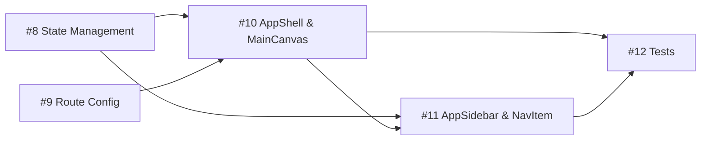

# Core Layout Shell & Sidebar

**Epic**: [#7](https://github.com/sameera/ripples/issues/7)

## Tasks

### Phase 1: Data Layer

- [#8](https://github.com/sameera/ripples/issues/8) — TASK-7.01: Sidebar State Management

### Phase 2: Core Logic

- [#9](https://github.com/sameera/ripples/issues/9) — TASK-7.02: Route Configuration & Placeholder Views
- [#10](https://github.com/sameera/ripples/issues/10) — TASK-7.03: AppShell & MainCanvas Layout
- [#11](https://github.com/sameera/ripples/issues/11) — TASK-7.04: AppSidebar & NavItem

### Phase 3: Polish

- [#12](https://github.com/sameera/ripples/issues/12) — TASK-7.05: Unit & E2E Tests

---

## Coverage Report

### User Stories → Tasks

| Story   | Title                                   | Mapped Tasks                    | Coverage |
| ------- | --------------------------------------- | ------------------------------- | -------- |
| Story 1 | View Persistent Sidebar Navigation      | TASK-7.02, TASK-7.04            | Full     |
| Story 2 | Collapse Sidebar to Icon-Only Mode      | TASK-7.03, TASK-7.04            | Full     |
| Story 3 | Persist Sidebar State Across Navigation | TASK-7.01, TASK-7.05            | Full     |
| Story 4 | Navigate Between Application Sections   | TASK-7.02, TASK-7.04, TASK-7.05 | Full     |
| Story 5 | Establish Main Canvas Container         | TASK-7.03                       | Full     |

**Coverage: 5/5 stories (100%)**

### HLD Components → Tasks

| Component              | Mapped Task | Status  |
| ---------------------- | ----------- | ------- |
| sidebarCollapsedAtom   | TASK-7.01   | Covered |
| toggleSidebarAtom      | TASK-7.01   | Covered |
| RouteConfig + NavRoute | TASK-7.02   | Covered |
| PlaceholderView        | TASK-7.02   | Covered |
| BrowserRouter wiring   | TASK-7.02   | Covered |
| AppShell (CSS Grid)    | TASK-7.03   | Covered |
| MainCanvas             | TASK-7.03   | Covered |
| AppSidebar             | TASK-7.04   | Covered |
| NavItem                | TASK-7.04   | Covered |
| CollapseToggle         | TASK-7.04   | Covered |

**Coverage: 10/10 components (100%)**

### NFRs → Tasks

| NFR   | Requirement         | Covered In | Via                                                   |
| ----- | ------------------- | ---------- | ----------------------------------------------------- |
| NFR-1 | Animation 150–200ms | TASK-7.03  | Acceptance Criteria + Implementation Notes            |
| NFR-2 | Zero CLS            | TASK-7.03  | Acceptance Criteria                                   |
| NFR-3 | No FOUC             | TASK-7.01  | Implementation Notes (atomWithStorage sync hydration) |
| NFR-4 | <16ms frame time    | TASK-7.03  | Implementation Notes (will-change hint)               |

**Coverage: 4/4 NFRs (100%)**

---

## Task Dependency Graph

## Parallelization Opportunities

- **Tasks #8 and #9** can be worked on simultaneously — no mutual dependencies
- Critical path: #8 → #10 → #11 → #12

## Effort Estimate

| Task                                       | Effort         |
| ------------------------------------------ | -------------- |
| #8 Sidebar State Management                | XS (< 4 hours) |
| #9 Route Configuration & Placeholder Views | S (4–8 hours)  |
| #10 AppShell & MainCanvas Layout           | S (4–8 hours)  |
| #11 AppSidebar & NavItem                   | M (1–2 days)   |
| #12 Unit & E2E Tests                       | S (4–8 hours)  |

**Total:** ~2–3 days (aligns with HLD estimate)
