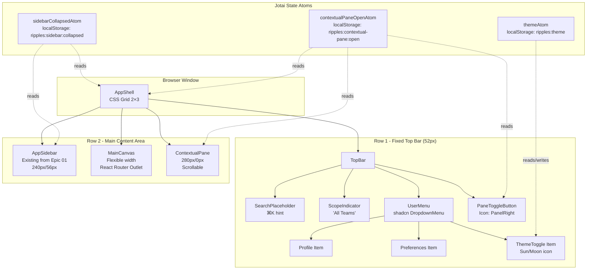

# High Level Design: Top Bar & Contextual Pane

**Epic**: Top Bar & Contextual Pane
**Feature**: Layout
**Created**: 2026-02-16
**Status**: Draft

---

## 1. Executive Summary

This epic completes the desktop layout structure by adding a top utility bar and a toggleable right contextual pane. The top bar provides a lightweight, low-contrast strip for global actions (search entry point, scope indicators, user menu), while the contextual pane offers an optional space for displaying metadata, filters, and insights without cluttering the main canvas.

**Key Objectives:**

- Establish the complete four-region hybrid layout: sidebar, top bar, main canvas, and contextual pane
- Provide space for global actions without competing with the canvas
- Enable contextual information display via a toggleable right pane
- Maintain canvas dominance as the primary visual region

**High-Level Approach:**

Extend the existing CSS Grid layout from Epic 01 into a 2-row × 3-column grid. Leverage the proven Jotai `atomWithStorage` pattern for pane state persistence. Install shadcn/ui DropdownMenu (Base UI backend) for the user menu. All new components follow established React component patterns with co-located tests.

---

## 2. Complexity Assessment

**Rating: M (Medium)**

**Justification:** Similar scope to Epic 01 (4-5 new components, 6 user stories), extends existing architecture rather than establishing it. Moderate technical risk from layout coordination. No data migration, minimal external dependencies.

| Factor                 | Assessment | Notes                                                                          |
| ---------------------- | ---------- | ------------------------------------------------------------------------------ |
| Scope                  | Medium     | 4-5 new components (TopBar, UserMenu, ScopeIndicator, ContextualPane, Toggle); 6 user stories |
| Technical Risk         | Low-Med    | Extends proven Epic 01 patterns; shadcn/ui DropdownMenu already compatible     |
| Integration Complexity | Medium     | Must integrate into existing AppShell Grid; coordinate three-panel layout      |
| Data Migration         | None       | localStorage only for pane state; no backend changes                           |

**Key Complexity Drivers:**

1. **Three-Region Layout Coordination** — AppShell must transition from 2-column to 2-row × 3-column grid while preserving sidebar behavior
2. **Responsive Width Management** — Contextual pane must enforce 240-320px default with 30% max viewport constraint
3. **State Synchronization** — Pane toggle state must persist and coordinate with canvas width recalculation

---

## 3. System Context

### Current System State

Established in Epic 01:

- **AppShell**: CSS Grid layout (`grid-template-columns: [sidebar-width] 1fr`)
- **AppSidebar**: Collapsible left navigation with Jotai state persistence
- **MainCanvas**: Independent scroll container with React Router Outlet
- **State Management**: Jotai atoms with localStorage via `atomWithStorage`
- **Routing**: React Router v7 with BrowserRouter
- **Component Library**: Base UI (@base-ui/react v1.1.0) primitives

Key files:

- `apps/web/src/app/layout/AppShell.tsx`
- `apps/web/src/app/sidebar/AppSidebar.tsx`
- `apps/web/src/state/sidebar.ts`

### External Dependencies

| Dependency       | Status                  | Action Required                            |
| ---------------- | ----------------------- | ------------------------------------------ |
| @base-ui/react   | Installed (v1.1.0)      | None                                       |
| shadcn/ui        | Not installed            | Install DropdownMenu component via CLI     |
| jotai            | Installed (v2.17.0)     | None                                       |
| React Router DOM | Installed (v7.13.0)     | None                                       |
| lucide-react     | Installed (v0.563.0)    | None                                       |
| Tailwind CSS     | Installed (v3.4)        | Configure additional animation utilities if needed |
| tailwindcss-animate | Installed (v1.0.7)   | None                                       |

### Technology Stack Summary

- **Frontend:** React 19, Vite 7, Tailwind CSS 3.4
- **Component Library:** Base UI primitives + shadcn/ui DropdownMenu (to be installed)
- **State:** Jotai v2.17.0 with `atomWithStorage`
- **Routing:** React Router v7.13.0
- **Icons:** lucide-react v0.563.0
- **Testing:** Vitest 4 (unit), Playwright 1.36 (E2E)

### Stack-Specific Constraints

1. shadcn/ui DropdownMenu must be installed with Base UI backend (not Radix)
2. Must preserve Epic 01's CSS custom properties pattern (`--sidebar-width`)
3. Top bar fixed/sticky; contextual pane scrolls independently; canvas scroll unaffected
4. Desktop-only (≥1024px breakpoint) — mobile behavior deferred to Epic 03

### Backwards Compatibility

Must maintain:

- Existing sidebar collapse/expand behavior
- Existing canvas scroll behavior
- Existing route navigation
- Existing Jotai state management pattern
- No breaking changes to AppShell component API

---

## 4. Requirements Analysis

### Functional Requirements

| ID    | Requirement                                          | Source    | Priority |
| ----- | ---------------------------------------------------- | --------- | -------- |
| FR-1  | Top bar spanning full width above canvas             | Story 1   | MUST     |
| FR-2  | Search entry point (placeholder) in top bar          | Story 1   | MUST     |
| FR-3  | Current scope indicator in top bar                   | Story 1,3 | MUST     |
| FR-4  | User menu dropdown in top bar                        | Story 2   | MUST     |
| FR-5  | User menu contains: Profile, Preferences, Theme Toggle | Story 2 | MUST     |
| FR-6  | Contextual pane toggles open/closed from right       | Story 4   | MUST     |
| FR-7  | Canvas adjusts width when pane opens/closes          | Story 4   | MUST     |
| FR-8  | Pane state persists across navigation                | Story 5   | MUST     |
| FR-9  | Pane state persists across refresh                   | Story 5   | MUST     |
| FR-10 | Canvas remains dominant with both panels open        | Story 6   | MUST     |

### Non-Functional Requirements

| ID    | Requirement                    | Target                | Measurement            |
| ----- | ------------------------------ | --------------------- | ---------------------- |
| NFR-1 | Top bar fixed height           | 48-56px               | CSS height property    |
| NFR-2 | Contextual pane default width  | 240-320px             | CSS width property     |
| NFR-3 | Contextual pane max width      | 30% viewport          | CSS max-width: 30vw    |
| NFR-4 | Pane transition duration       | 200-250ms             | CSS transition         |
| NFR-5 | Canvas dominance               | Canvas ≥ 50% viewport | Grid calculation       |
| NFR-6 | No layout shift on toggle      | Zero CLS              | Lighthouse metric      |

### Technical Constraints

- Desktop only: minimum 1024px viewport width
- Fixed top bar: always visible, does not scroll
- Search entry point is placeholder only (Epic 04 implements functionality)
- Scope indicator displays static text; filtering logic out of scope
- Canvas dominance: with sidebar (240px) + pane (320px max), canvas must be ≥ 50% of remaining space

### Design Specifications

| Specification            | Value                  | Rationale                                          |
| ------------------------ | ---------------------- | -------------------------------------------------- |
| Top bar height           | 52px (recommended)     | Within 48-56px range; sufficient for search + icons |
| Top bar background       | Gray-50/White          | Low contrast to reduce visual weight               |
| Top bar border           | Bottom border, subtle  | Defines region without heavy separation            |
| Pane default width       | 280px                  | Within 240-320px range; balanced with sidebar      |
| Pane max width           | 30vw                   | Prevents pane from dominating on wide screens      |
| Pane background          | White/Gray-50          | Matches sidebar visual language                    |
| Toggle button position   | Top bar right side     | Adjacent to pane for spatial affordance            |
| User menu position       | Top bar right, before toggle | Standard UI pattern                           |

### Out of Scope

| Item                            | Epic/Future | Rationale                        |
| ------------------------------- | ----------- | -------------------------------- |
| Mobile top bar behavior         | Epic 03     | Mobile responsive layout         |
| Search functionality            | Epic 04     | Command palette implementation   |
| Scope filtering logic           | Future      | Backend integration required     |
| Theme persistence/application   | Future      | Requires theme provider setup    |
| Actual contextual content       | Feature-specific | Content provided by views   |
| Keyboard shortcuts              | Epic 04     | Command palette epic             |
| Pane resize handle              | Future      | Enhancement beyond MVP           |

### Assumptions

- Theme toggle in user menu is client-side only (localStorage), no backend sync
- Scope indicator displays static placeholder text ("All Teams" or similar)
- Pane toggle button uses icon-only design (no label)

---

## 5. Architecture Overview

### Component Architecture Diagram



### Layout Visual Reference

```
┌─────────────────────────────────────────────────────────────┐
│                        Top Bar (52px)                       │
│  [Search ⌘K]  [Scope: All Teams]      [User] [Pane Toggle] │
├──────────┬────────────────────────────────┬─────────────────┤
│          │                                │                 │
│          │                                │   Contextual    │
│ Sidebar  │         Main Canvas            │      Pane       │
│ (240px)  │        (Flexible width)        │    (280px)      │
│          │                                │                 │
│          │                                │   [Content]     │
│  [Nav]   │   <Outlet />                   │                 │
│  [Nav]   │                                │   Scrollable    │
│  [Nav]   │   Independent scroll           │                 │
│          │                                │                 │
└──────────┴────────────────────────────────┴─────────────────┘

Grid Definition:
- Rows: 52px 1fr
- Columns: var(--sidebar-width) 1fr var(--pane-width)
```

### Frontend Layer

**New Components:** TopBar, SearchPlaceholder, ScopeIndicator, UserMenu, ThemeToggle, ContextualPane, PaneToggleButton

**Modified Components:** AppShell (refactored from 2-column to 2-row × 3-column grid)

### State Management

Extend the Jotai pattern with new atoms for pane state and theme preference, both using `atomWithStorage` for localStorage persistence.

### Layout Integration

The AppShell grid evolves from:

```css
grid-template-columns: var(--sidebar-width) 1fr;
```

To:

```css
grid-template-rows: 52px 1fr;
grid-template-columns: var(--sidebar-width) 1fr var(--pane-width);
```

Where `--pane-width` is `280px` (open) or `0px` (closed), animated via CSS transition on `grid-template-columns` at 200ms ease-out.

---

## 6. Data Model Strategy

### State Atoms

#### contextualPaneOpenAtom

```typescript
import { atomWithStorage } from "jotai/utils";

export const contextualPaneOpenAtom = atomWithStorage<boolean>(
    "ripples:contextual-pane:open",
    false
);
```

- **Storage:** localStorage key `ripples:contextual-pane:open`
- **Format:** JSON boolean
- **Default:** `false` (pane closed)

#### themeAtom (Optional)

```typescript
export const themeAtom = atomWithStorage<"light" | "dark">(
    "ripples:theme",
    "light"
);
```

- **Storage:** localStorage key `ripples:theme`
- **Default:** `"light"`

### localStorage Schema

```typescript
{
    "ripples:sidebar:collapsed": boolean,        // Epic 01 - existing
    "ripples:contextual-pane:open": boolean,     // Epic 02 - new
    "ripples:theme": "light" | "dark"            // Epic 02 - new (optional)
}
```

### Context Providers

None required — Jotai atoms provide global state without Context providers.

---

## 7. API Design Strategy

**N/A for this epic.** This is purely client-side UI infrastructure. No backend API changes required.

Future epics may add:

- User profile data endpoint (for UserMenu avatar/name)
- User preferences API (for syncing theme, pane state across devices)
- Scope filtering API (for ScopeIndicator data)

---

## 8. Frontend Architecture

### Component Structure

```
apps/web/src/
├── app/
│   ├── layout/
│   │   ├── AppShell.tsx                  # Modified - 2-row × 3-col grid
│   │   ├── AppShell.spec.tsx             # Updated tests
│   │   ├── TopBar.tsx                    # New
│   │   ├── TopBar.spec.tsx               # New
│   │   ├── MainCanvas.tsx                # Unchanged
│   │   └── MainCanvas.spec.tsx
│   ├── sidebar/                          # Unchanged from Epic 01
│   │   ├── AppSidebar.tsx
│   │   ├── AppSidebar.spec.tsx
│   │   ├── NavItem.tsx
│   │   └── NavItem.spec.tsx
│   ├── top-bar/                          # New directory
│   │   ├── SearchPlaceholder.tsx         # New
│   │   ├── SearchPlaceholder.spec.tsx    # New
│   │   ├── ScopeIndicator.tsx            # New
│   │   ├── ScopeIndicator.spec.tsx       # New
│   │   ├── UserMenu.tsx                  # New
│   │   ├── UserMenu.spec.tsx             # New
│   │   └── ThemeToggle.tsx               # New
│   ├── contextual-pane/                  # New directory
│   │   ├── ContextualPane.tsx            # New
│   │   ├── ContextualPane.spec.tsx       # New
│   │   └── PaneToggleButton.tsx          # New
│   └── routes/                           # Unchanged
├── components/
│   └── ui/                               # New - shadcn components
│       └── dropdown-menu.tsx             # New - installed via CLI
└── state/
    ├── sidebar.ts                        # Existing
    ├── sidebar.spec.ts
    ├── contextual-pane.ts                # New
    ├── contextual-pane.spec.ts           # New
    └── theme.ts                          # New (optional)
```

### Key Component Specifications

#### TopBar

Fixed-height container for global utilities. Renders SearchPlaceholder, ScopeIndicator, UserMenu, and PaneToggleButton in a flex layout. Height: 52px, low-contrast background with subtle bottom border.

#### SearchPlaceholder

Visual placeholder styled as an inactive input field with search icon, "Search..." text, and keyboard hint (`⌘K`). Non-functional until Epic 04.

#### ScopeIndicator

Static text display showing current scope context ("All Teams"). Uses Building icon from lucide-react. Future enhancement replaces static text with dynamic scope data.

#### UserMenu

shadcn/ui DropdownMenu with user avatar trigger. Contains Profile, Preferences, and ThemeToggle items. Accessible keyboard navigation built-in.

#### ThemeToggle

Toggle item within UserMenu dropdown. Reads/writes `themeAtom`. Displays Sun/Moon icon based on current theme. Stores preference in localStorage but does not apply theme in this epic.

#### ContextualPane

Toggleable right panel. Width transitions between 0px (closed) and 280px (open) with max-width of 30vw. Independent vertical scroll. Accepts children for future contextual content. Uses `data-open` attribute for test selectors.

#### PaneToggleButton

Icon button in TopBar using PanelRight icon from lucide-react. Rotates 180deg when pane is open. Proper `aria-label` for accessibility.

### AppShell Refactoring

The AppShell evolves to support the 2-row × 3-column grid:

```tsx
const TOPBAR_HEIGHT = "52px";
const PANE_WIDTH_OPEN = "280px";

export function AppShell() {
    const sidebarCollapsed = useAtomValue(sidebarCollapsedAtom);
    const paneOpen = useAtomValue(contextualPaneOpenAtom);

    const sidebarWidth = sidebarCollapsed ? SIDEBAR_WIDTH_COLLAPSED : SIDEBAR_WIDTH_EXPANDED;
    const paneWidth = paneOpen ? PANE_WIDTH_OPEN : "0px";

    return (
        <div
            className="grid h-screen"
            style={{
                gridTemplateRows: `${TOPBAR_HEIGHT} 1fr`,
                gridTemplateColumns: `${sidebarWidth} 1fr ${paneWidth}`,
                transition: "grid-template-columns 200ms ease-out",
            }}
        >
            <TopBar />
            <aside className="sticky top-0 h-full overflow-y-auto bg-gray-50">
                <AppSidebar />
            </aside>
            <MainCanvas />
            <ContextualPane />
        </div>
    );
}
```

### Animation/Transition Approach

- `grid-template-columns` transition at 200ms ease-out for pane open/close
- Pane uses `width: 0` when closed, `width: 280px` when open
- `overflow: hidden` on pane when closed to prevent content flash
- No JavaScript animation libraries needed — pure CSS transitions

---

## 9. Security Architecture

| Concern                          | Risk Level | Mitigation                                           |
| -------------------------------- | ---------- | ---------------------------------------------------- |
| localStorage data exposure       | Low        | UI preferences only, non-sensitive data              |
| XSS via user menu                | Low        | No user-generated content in menu                    |
| Client-side theme injection      | None       | Controlled Tailwind classes only                     |
| shadcn/ui component vulnerabilities | Low     | Official components with security audits             |

**Data Protection:** No authentication, authorization, or sensitive data handling in this epic. localStorage stores only UI preferences (booleans, theme string).

**Accessibility Security:** shadcn/ui DropdownMenu follows WAI-ARIA 1.2 patterns. Keyboard navigation prevents focus traps. Proper ARIA labels on toggle buttons.

---

## 10. Key Technical Decisions

| Decision | Rationale | Alternatives Considered | Trade-offs |
| -------- | --------- | ----------------------- | ---------- |
| **Extend CSS Grid to 2-row × 3-column** | Natural evolution of Epic 01 pattern; CSS Grid excels at two-dimensional layouts; maintains CSS custom property approach | Flexbox (nested containers, more complex calc); Absolute positioning (brittle) | Slightly more complex grid definition, but cleaner than alternatives; enables future layout extensions |
| **shadcn/ui DropdownMenu for UserMenu** | Industry-standard accessible menu; Base UI backend matches Epic 01; keyboard navigation built-in | Custom dropdown (reinventing wheel); Base UI Menu directly (no pre-styled component) | Additional component install step, but saves development time and ensures accessibility compliance |
| **Jotai atom for pane state** | Consistent with Epic 01 sidebar pattern; `atomWithStorage` handles localStorage sync; minimal boilerplate | React Context (boilerplate overhead); useState + useEffect (manual sync); URL query params (pollutes URLs) | Pattern consistency outweighs additional state file; enables future state composition |
| **Fixed pane width (280px) vs resizable** | MVP simplicity; meets 90% of use cases; avoids complex resize handle logic | Resizable panel with drag handle (complexity); Multiple preset widths (premature optimization) | Less flexible for power users, but can be added in future without refactoring |
| **Placeholder search in TopBar** | Establishes visual location for Epic 04; sets user expectation; simple non-functional button | Omit until Epic 04 (misses spatial learning opportunity); Full search (out of scope) | kbd hint (`⌘K`) communicates future functionality |

---

## 11. Technical Debt Analysis

### Debt Incurred

| Debt Item                         | Type        | Severity | Rationale                                          |
| --------------------------------- | ----------- | -------- | -------------------------------------------------- |
| Placeholder search functionality  | Intentional | Low      | Search implemented in Epic 04; clear visual indicator |
| Static scope indicator text       | Intentional | Low      | Scope filtering logic out of scope; documented in code |
| Theme toggle non-functional       | Intentional | Medium   | localStorage value stored but not applied; future epic adds Tailwind dark mode |
| Fixed pane width (no resize)      | Intentional | Low      | Width chosen based on UX needs; resize handle addable without refactoring |

### Debt Avoided

| Item                               | How Avoided                                                    |
| ---------------------------------- | -------------------------------------------------------------- |
| Manual localStorage sync           | Using Jotai `atomWithStorage` (automatic sync)                 |
| Custom accessible dropdown         | Using shadcn/ui DropdownMenu (WAI-ARIA compliant)              |
| Complex animation state management | Using CSS transitions with custom properties (declarative)     |
| Nested scroll container bugs       | Explicit overflow properties and height constraints from Epic 01 |
| Layout shift on pane toggle        | Grid transition with `width: 0` when closed (no layout reflow) |

**Net Debt Assessment:** **Positive** — Maintains clean patterns from Epic 01, avoids common pitfalls, and defers only low-severity items to appropriate future epics.

---

## 12. Implementation Phases

| Phase   | Objective                     | Key Deliverables                                        | Dependencies       | Estimate  |
| ------- | ----------------------------- | ------------------------------------------------------- | ------------------ | --------- |
| Phase 1 | shadcn/ui Setup               | Install DropdownMenu component; verify Base UI backend  | None               | 0.25 days |
| Phase 2 | State Management              | Create `contextual-pane.ts` and `theme.ts` atoms; unit tests | Phase 1       | 0.25 days |
| Phase 3 | Top Bar Implementation        | TopBar, SearchPlaceholder, ScopeIndicator, UserMenu, ThemeToggle; unit tests | Phase 2 | 0.5 days |
| Phase 4 | Contextual Pane Implementation | ContextualPane and PaneToggleButton; integrate into grid; CSS transitions | Phase 2 | 0.5 days |
| Phase 5 | AppShell Refactoring          | Refactor AppShell to 2-row × 3-column grid; integrate all components; update tests | Phase 3, 4 | 0.25 days |
| Phase 6 | Testing & Polish              | E2E tests; visual testing; transition performance; accessibility audit | Phase 5 | 0.25 days |

**Total Estimated Duration:** ~2 days

**Critical Path:** Phase 1 → Phase 2 → (Phase 3 & Phase 4 in parallel) → Phase 5 → Phase 6

**Parallelization:** Phase 3 (TopBar) and Phase 4 (ContextualPane) can be developed in parallel after Phase 2 completes.

---

## 13. Risk Assessment

| Risk | Likelihood | Impact | Mitigation Strategy |
| ---- | ---------- | ------ | ------------------- |
| Grid layout behavior mismatch across browsers | Low | Medium | Test in Chrome, Firefox, Safari; CSS Grid has 97%+ browser support |
| DropdownMenu component conflicts with existing Base UI setup | Medium | Medium | Install via official shadcn CLI with `--backend base-ui`; verify in isolation before integration |
| Pane transition jank on lower-end devices | Medium | Low | Use `will-change` sparingly; test on mid-range hardware; respect `prefers-reduced-motion` |
| Canvas width too narrow with sidebar + pane both open | Low | Medium | On 1024px: sidebar (240) + pane (280) = 520px, canvas = 504px (49%); enforce pane max-width: 30vw |
| Theme toggle confusion (non-functional) | Medium | Low | Add tooltip or disabled state to indicate "Coming soon" |

---

## 14. Operational Considerations

**N/A for client-side layout infrastructure.** This epic involves purely client-side UI components with no server-side operations, monitoring requirements, or deployment considerations beyond the standard web app build.

### Feature Flag Approach (Optional)

If gradual rollout is desired, feature flags can be implemented via localStorage-backed Jotai atoms to enable/disable the top bar and contextual pane independently without code deployment.

---

## 15. Testing Strategy

### Unit Tests (Vitest + Testing Library)

| Component              | Test Cases                                                                    |
| ---------------------- | ----------------------------------------------------------------------------- |
| contextualPaneOpenAtom | Initial value `false`; persists to localStorage; toggle updates state         |
| themeAtom              | Initial value `"light"`; persists to localStorage; updates correctly          |
| TopBar                 | Renders all child components; applies correct height styles                   |
| SearchPlaceholder      | Renders search icon and text; shows keyboard hint                             |
| ScopeIndicator         | Renders scope text and icon                                                   |
| UserMenu               | Opens on click; contains Profile, Preferences, ThemeToggle; closes on item click |
| ThemeToggle            | Renders correct icon; toggles theme on click                                  |
| ContextualPane         | Renders when open; hides when closed; applies correct width; renders children |
| PaneToggleButton       | Toggles pane on click; correct aria-label; icon rotates when open             |
| AppShell (updated)     | Applies 2-row grid; applies 3-column grid; adjusts pane width based on state |

### E2E Tests (Playwright)

| Scenario                               | Coverage                                               |
| -------------------------------------- | ------------------------------------------------------ |
| Top bar displays all components        | Search placeholder, scope indicator, user menu visible |
| User menu opens and shows all items    | Profile, Preferences, Theme items present              |
| Pane toggles open and closed           | Width changes, data-open attribute updates             |
| Pane state persists across navigation  | Open pane → navigate → verify still open               |
| Pane state persists across refresh     | Open pane → reload → verify still open                 |
| Canvas adjusts width when pane opens   | Canvas width decreases when pane opens                 |
| All four regions visible together      | Sidebar expanded + pane open → all regions present     |
| Canvas maintains minimum width         | With both panels open, canvas ≥ 40% viewport           |

### Accessibility Testing

- Keyboard navigation through user menu (Tab, Enter, Escape)
- Screen reader announces pane open/close state
- Focus management when menu opens
- Color contrast meets WCAG AA (3:1 for UI components)
- Reduced motion support (`prefers-reduced-motion` media query)

### Critical Test Paths

1. **Pane persistence flow** — Open → navigate → refresh → verify still open
2. **Grid layout coordination** — Sidebar collapse/expand + pane open/close combinations
3. **Canvas dominance** — Verify canvas width ≥ 40% in all states
4. **User menu accessibility** — Keyboard navigation and screen reader support

---

## 16. Success Criteria

| Criterion               | Measurement                        | Target                |
| ----------------------- | ---------------------------------- | --------------------- |
| Functional completeness | Acceptance criteria passing        | 100% of 6 stories     |
| Unit test coverage      | Lines covered in new components    | ≥80%                  |
| E2E test coverage       | Critical paths tested              | 100%                  |
| Top bar height          | Measured CSS height                | 48-56px               |
| Pane default width      | Measured width when open           | 240-320px             |
| Pane max width          | Measured on wide screens           | ≤30vw                 |
| Transition performance  | Frame time during animation        | <16ms (60fps)         |
| Layout stability        | Cumulative Layout Shift (CLS)      | 0                     |
| Canvas dominance        | Canvas width with both panels open | ≥40% viewport         |
| Pane persistence        | State survives navigation + refresh | 100%                 |
| Build success           | `npx nx build ripples`             | No errors             |
| Type safety             | `npx nx typecheck ripples`         | No errors             |
| Lint compliance         | `npx nx lint ripples`              | No errors             |
| Accessibility           | axe-core violations                | 0 critical/serious    |

---

## Appendix

### Glossary

| Term              | Definition                                                              |
| ----------------- | ----------------------------------------------------------------------- |
| Utility Bar       | Lightweight top strip for global actions, distinct from navigation      |
| Contextual Pane   | Right-side panel showing context-specific information                   |
| Scope             | The current filter context (team, project, time range)                  |
| Canvas Dominance  | Design principle ensuring main content area remains visually primary    |
| atomWithStorage   | Jotai utility that syncs atom state to localStorage                     |

### Related Documents

- [Epic Document](./epic.md) — User stories and acceptance criteria
- [Epic 01: Core Layout Shell & Sidebar](../01-core-layout-shell-sidebar/epic.md) — Prerequisite epic
- [Epic 01 HLD](../01-core-layout-shell-sidebar/HLD.md) — Foundational architecture
- [Layout Feature Brief](../README.md) — Parent feature overview
- [React Component Patterns](../../../system/standards/react-component-patterns.md) — Component standards
- [Testing Patterns](../../../system/standards/testing-patterns.md) — Testing standards
- [Product Context](../../../product/context.md) — Product vision and principles
