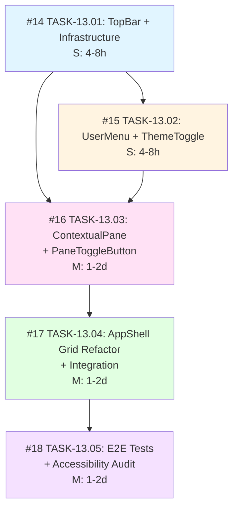

# Top Bar & Contextual Pane

**Epic**: [#13](https://github.com/sameera/ripples/issues/13)

## Tasks

### Phase 1: Infrastructure + Core UI

- [#14](https://github.com/sameera/ripples/issues/14) - TASK-13.01: Implement TopBar with SearchPlaceholder and ScopeIndicator
- [#15](https://github.com/sameera/ripples/issues/15) - TASK-13.02: Implement UserMenu with ThemeToggle

### Phase 2: Core Logic

- [#16](https://github.com/sameera/ripples/issues/16) - TASK-13.03: Implement ContextualPane with PaneToggleButton

### Phase 3: Integration

- [#17](https://github.com/sameera/ripples/issues/17) - TASK-13.04: Refactor AppShell to 2-Row × 3-Column Grid and Integrate All Components

### Phase 4: Polish

- [#18](https://github.com/sameera/ripples/issues/18) - TASK-13.05: Add E2E Tests and Accessibility Audit

## Task Dependency Graph

## Parallelization Opportunities

- **TASK-13.01** and **TASK-13.02** can be developed in parallel after the infrastructure setup portion of TASK-13.01 is complete (shadcn/ui installation and state atoms). However, since TASK-13.01 now includes the infrastructure setup, TASK-13.02 depends on it.
- **TASK-13.03** through **TASK-13.05** must be sequential.

## Effort Estimate

| Task | Effort | Estimate |
|------|--------|----------|
| TASK-13.01 | S | 4-8 hours |
| TASK-13.02 | S | 4-8 hours |
| TASK-13.03 | M | 1-2 days |
| TASK-13.04 | M | 1-2 days |
| TASK-13.05 | M | 1-2 days |
| **Total** | | **~1.5-2 days** (with parallelization) |
